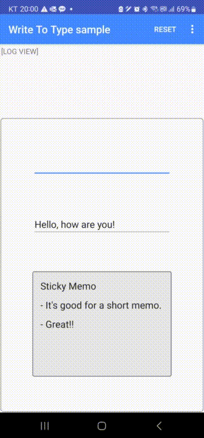
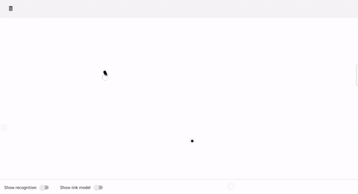

# MyScript Interactive Ink Samples

Interactive Ink SDK is the best way to integrate handwriting recognition capabilities into your Android application. Interactive Ink extends digital ink to allow users to more intuitively create, interact with, and share content in digital form. Handwritten text, mathematical equations or even diagrams are interpreted in real-time to be editable via simple gestures, responsive and easy to convert to a neat output.

You can find two examples that help you starting with Interactive Ink SDK on [MyScript Developer Portal](https://developer.myscript.com/docs/interactive-ink/latest/android/).

This repository comes in addition with further advanced Android examples that developers using Interactive Ink SDK can reuse inside their projects or from which they could draw inspiration.

## Installation

1. Clone the examples repository `git clone https://github.com/MyScript/iink_sdk-additional-examples-android.git`.

2. If you already have a certificate go to next step, else claim to receive the free license to start develop your application by following the first steps of [Getting Started](https://developer.myscript.com/getting-started).

3. Copy this certificate to `samples/certificate/src/main/java/com/myscript/certificate/MyCertificate.java`

4. Open `samples` folder in Android Studio.

## Various examples

This repository provides you with an additional set of ready-to-use examples based on Android:

1. The batch mode sample is an example of how to integrate iink SDK without any user interface. It consists in batch processing content, i.e. processing a series of pointer events corresponding to already collected ink strokes and exporting the recognition result. It comes with four pointer events samples that correspond to four different content types "Text", "Math", "Diagram", "Raw Content". When starting the app a dialog will be displayed to choose which type of part you want to proceed. By default those content types are exported in respectively .txt, LaTeX, svg and JIIX formats, but you can choose to export in png depending on your choice in the configuration window.

2. The exercise assessment illustrates the case when you want to use several writing areas each one for a specific purpose in your application. It is thus using multiple editors, one per writing area, as each one has a different purpose:
- First one is dedicated to "Math" content types
- Second one is dedicated to "Math" content types but with a user defined grammar which is dynamically loaded at start.
- Third one is dedicated to "Text" content types
- Fourth one is dedicated to "Diagram" content types
- Fifth one is dedicated to "Draw" content types

 

3. The search example shows how to perform word search on raw digital ink and highlights the result found in the ink. it is based on "Raw Content" Content Type by default but you can change it to "Text Document" by modifying the following line in the MainActivity class:

~~~#!java
  // wait for view size initialization before setting part
        editorView!!.post(Runnable() {
            val partType = "Raw Content" // change to "Text Document" if you want to test
~~~

 

4. The write to type example gives you a hint how to implement Scribble like feature relying on the Recognizer API of iink SDK. It is based on a contextless gesture recognition combined with a text recognition.
To run both recognitions simultaneously, two instances of Recognizer are created - one for Gesture recognition and the other one for Text recognition:
~~~#!java
    static final float INCH_IN_MILLIMETER = 25.4f;

    float scaleX = INCH_IN_MILLIMETER / displayMetrics.xdpi;
    float scaleY = INCH_IN_MILLIMETER / displayMetrics.ydpi;

    Recognizer textRecognizer = engine.createRecognizer(scaleX, scaleY, "Text");
    Recognizer gestureRecognizer = engine.createRecognizer(scaleX, scaleY, "Gesture");
~~~

 

NB: the Recognizer API is available from iink SDK 2.1.

For more details on the sample, read more [here](samples/write-to-type/ReadMe.pdf). 

5. The offscreen-interactivity samples shows how to integrate MyScript iink SDK interactivity with your own rendering.
It drives the content model by sending the captured strokes to iink SDK and keeps the incremental recognition principle and gesture notifications.
This sample uses a third-party rendering library to manage the captured strokes and display its model, and get real-time recognition results and gesture notifications.

 

6. The keyboard input sample shows a specific usage for the `Placeholder` feature. In this sample, you'll be able to input text by keyboard within an iink document, with minumum code.
It shows how to manage switching from an Android view to an image managed by iink.

7. The handwriting generation sample demonstrates the use of MyScript's handwriting generation APIs. It shows how to generate ink from text input, in different styles, and how to create a style from your own handwriting.
To use the handwriting generation, you must [contact our sales team](https://developer.myscript.com/contact-us/on-device-recognition). You will then have access to the "myscript-iink-handwriting-generation" resource package, from which `handwriting_generation` folder must extracted and copied to `samples/hwgeneration/src/main/assets/resources/`

## Documentation

A complete guide is available on [MyScript Developer Portal](https://developer.myscript.com/docs/interactive-ink/latest/android/).

The API Reference is available directly in Android Studio once the dependencies are downloaded.

## Getting support

You can get some support from the dedicated section on [MyScript Developer Portal](https://developer.myscript.com/support/).

## Sharing your feedback

Made a cool app with Interactive Ink? Ready to cross join our marketing efforts? We would love to hear about you!
We’re planning to showcase apps using it so let us know by sending a quick mail to [myapp@myscript.com](mailto://myapp@myscript.com).

## Contributing

We welcome your contributions:
If you would like to extend those examples for your needs, feel free to fork them!
Please sign our [Contributor License Agreement](CONTRIBUTING.md) before submitting your pull request.