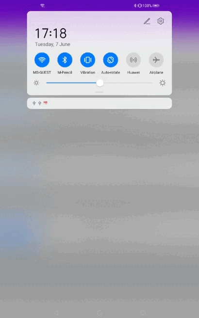
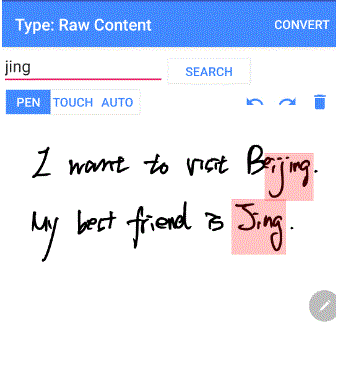
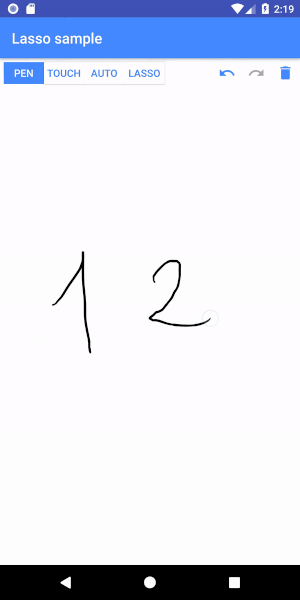

# MyScript Interactive Ink Samples

Interactive Ink SDK is the best way to integrate handwriting recognition capabilities into your Android application. Interactive Ink extends digital ink to allow users to more intuitively create, interact with, and share content in digital form. Handwritten text, mathematical equations or even diagrams are interpreted in real-time to be editable via simple gestures, responsive and easy to convert to a neat output.

You can find two examples that help you starting with Interactive Ink SDK on [MyScript Developer Portal](https://developer.myscript.com/docs/interactive-ink/latest/android/).

This repository comes in addition with further advanced Android examples that developers using Interactive Ink SDK can reuse inside their projects or from which they could draw inspiration.

## Installation

1. Clone the examples repository  `git clone https://github.com/MyScript/iink_sdk-additional-examples-android.git`.

2. If you already have a certificate go to next step, else claim to receive the free license to start develop your application by following the first steps of [Getting Started](https://developer.myscript.com/getting-started).

3. Copy this certificate to `certificate/src/main/java/com/myscript/certificate/MyCertificate.java`

## Various examples

This repository provides you with an additional set of ready-to-use examples based on Android:

1. The batch mode sample is an example of how to integrate iink SDK off-screen, without any user interface. It consists in batch processing content, i.e. processing a series of pointer events corresponding to already collected ink strokes and exporting the recognition result. It comes with four pointer events samples that correspond to four different content types "Text", "Math", "Diagram", "Raw Content". Those content types are exported in respectively .txt, LaTeX, svg and JIIX formats. By default, the example is working with the "Text" content type but all you have to do to try another type is modifying the content type in the MainActivity class:

~~~#!java
    // Choose type of content ("Text", "Math", "Diagram", "Raw Content")
    private static String partType = "Text";
~~~

2. The exercise assessment illustrates the case when you want to use several writing areas each one for a specific purpose (here the example is based on problem solving and score writing) in your application. It is thus using multiple editors, one per writing area, as each one has a different purpose: one of them is dedicated to "Math" content types and the three other ones to "Text" content type.

 

3. The search example shows how to perform word search on raw digital ink and highlights the result found in the ink. it is based on "Raw Content" Content Type.

 

4. The lasso example is illustrating how you can perform recognition of strokes captured with a lasso in the drawing area of your application: It is based on two "Drawing" parts: one for the drawing/writing area and the other one for the lasso capture. In lasso mode, the lassoed strokes are sent as a series of event to a batch recognition of a "Text" part and the result is displayed.

 

## Documentation

A complete guide is available on [MyScript Developer Portal](https://developer.myscript.com/docs/interactive-ink/latest/android/).

The API Reference is available directly in Android Studio once the dependencies are downloaded.

## Getting support

You can get some support from the dedicated section on [MyScript Developer Portal](https://developer.myscript.com/support/).

## Sharing your feedback

Made a cool app with Interactive Ink? Ready to cross join our marketing efforts? We would love to hear about you!
We’re planning to showcase apps using it so let us know by sending a quick mail to [myapp@myscript.com](mailto://myapp@myscript.com).

## Contributing

We welcome your contributions:
If you would like to extend those examples for your needs, feel free to fork them!
Please sign our [Contributor License Agreement](CONTRIBUTING.md) before submitting your pull request.
